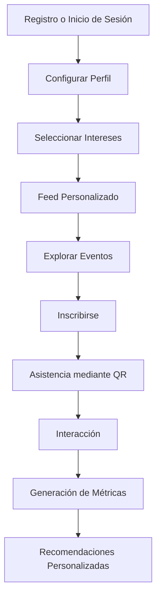

# 🎓 CampusHub

<div align="center">

### Plataforma inteligente que centraliza, gestiona y analiza eventos universitarios en tiempo real

[]()
[]()
[]()
[]()

</div>

---

## 📖 Descripción

**CampusHub** es una plataforma digital diseñada para transformar la experiencia universitaria mediante la centralización de eventos académicos, servicios colaborativos, préstamos de recursos y un marketplace estudiantil dentro de un único ecosistema digital.

La solución busca eliminar la dispersión de información en redes sociales, grupos de mensajería y correos electrónicos, permitiendo a los estudiantes descubrir oportunidades relevantes, interactuar con su comunidad y acceder a recursos académicos de manera eficiente.

---

## 🎯 Problema

Actualmente, la información sobre actividades universitarias se encuentra distribuida en múltiples canales, generando:

- Baja visibilidad de eventos.
- Pérdida de oportunidades académicas.
- Escasa participación estudiantil.
- Dificultad para medir el impacto de actividades.
- Falta de espacios colaborativos centralizados.
- Ausencia de información para la toma de decisiones.

---

## 💡 Solución

CampusHub integra múltiples servicios universitarios en una sola plataforma:

| Módulo | Descripción |
|---------|------------|
| 📅 Eventos | Gestión completa de eventos universitarios |
| 👥 Comunidad | Interacción y participación estudiantil |
| 🛠️ Servicios | Oferta y solicitud de servicios entre estudiantes |
| 📚 Préstamos | Gestión de recursos académicos compartidos |
| 🛒 Marketplace | Compra, venta e intercambio de productos |
| 📊 Analítica | Métricas y visualización de datos en tiempo real |

---

# 🚀 Características Principales

## 📅 Gestión de Eventos

- Creación y administración de eventos.
- Feed personalizado basado en intereses.
- Inscripción de participantes.
- Códigos QR para control de asistencia.
- Check-in en tiempo real.
- Comentarios y reacciones.
- Clasificación por categorías.

## 👤 Gestión de Usuarios

- Registro e inicio de sesión.
- Perfil académico personalizado.
- Gestión de intereses.
- Historial de participación.
- Recomendaciones inteligentes.

## 🛠️ Servicios Colaborativos

- Publicación de servicios.
- Solicitud de servicios.
- Comunicación entre usuarios.
- Sistema de calificaciones.

Ejemplos:

- Tutorías.
- Programación.
- Diseño gráfico.
- Asesorías académicas.
- Freelance estudiantil.

## 📚 Sistema de Préstamos

- Publicación de recursos.
- Solicitud de préstamo.
- Gestión de disponibilidad.
- Control de devolución.

Recursos admitidos:

- Libros.
- Calculadoras.
- Laptops.
- Equipos electrónicos.
- Material académico.

## 🛒 Marketplace Universitario

- Publicación de productos.
- Compra y venta.
- Intercambio de recursos.
- Sistema de reputación.
- Filtros por categoría.

## 📊 Analítica e Inteligencia de Datos

- Asistencia por evento.
- Participación estudiantil.
- Eventos más populares.
- Interacciones generadas.
- Tendencias de interés.
- Indicadores para la toma de decisiones.

---

# 🏗️ Arquitectura Funcional

```text
┌──────────────────────────────┐
│          Usuarios            │
└──────────────┬───────────────┘
               │
               ▼
┌──────────────────────────────┐
│         CampusHub            │
└──────────────┬───────────────┘
               │
     ┌─────────┼─────────┐
     ▼         ▼         ▼
 Eventos   Servicios  Marketplace
     │         │         │
     └────┬────┴────┬────┘
          ▼         ▼
      Préstamos  Analítica
```

---

# 🔄 Flujo General del Usuario



---

# 📋 Módulos del Sistema

| Módulo | Funcionalidades |
|----------|----------------|
| Usuarios | Registro, autenticación, perfil, historial |
| Eventos | Creación, inscripción, asistencia QR |
| Servicios | Publicación, contratación, valoración |
| Préstamos | Solicitudes y control de recursos |
| Marketplace | Compra, venta e intercambio |
| Analítica | Estadísticas e indicadores |

---

# 🎯 Público Objetivo

### Usuarios Directos

- Estudiantes universitarios.
- Capítulos estudiantiles.
- Organizaciones académicas.
- Docentes.
- Organizadores de eventos.

### Usuarios Indirectos

- Facultades.
- Escuelas profesionales.
- Universidades.
- Instituciones educativas.

---

# 👨‍💻 Equipo de Desarrollo

## UniHub Developers

| Integrante |
|------------|
| Maria Solange Ezcurra Paima |
| Melsy Melany Huamaní Vargas |

---

# 🎓 Información Académica

| Campo | Información |
|---------|------------|
| Universidad | Universidad Nacional de San Agustín de Arequipa |
| Escuela Profesional | Ingeniería de Sistemas |
| Año | 2026 |
| País | Perú |

---

<div align="center">

</div>
